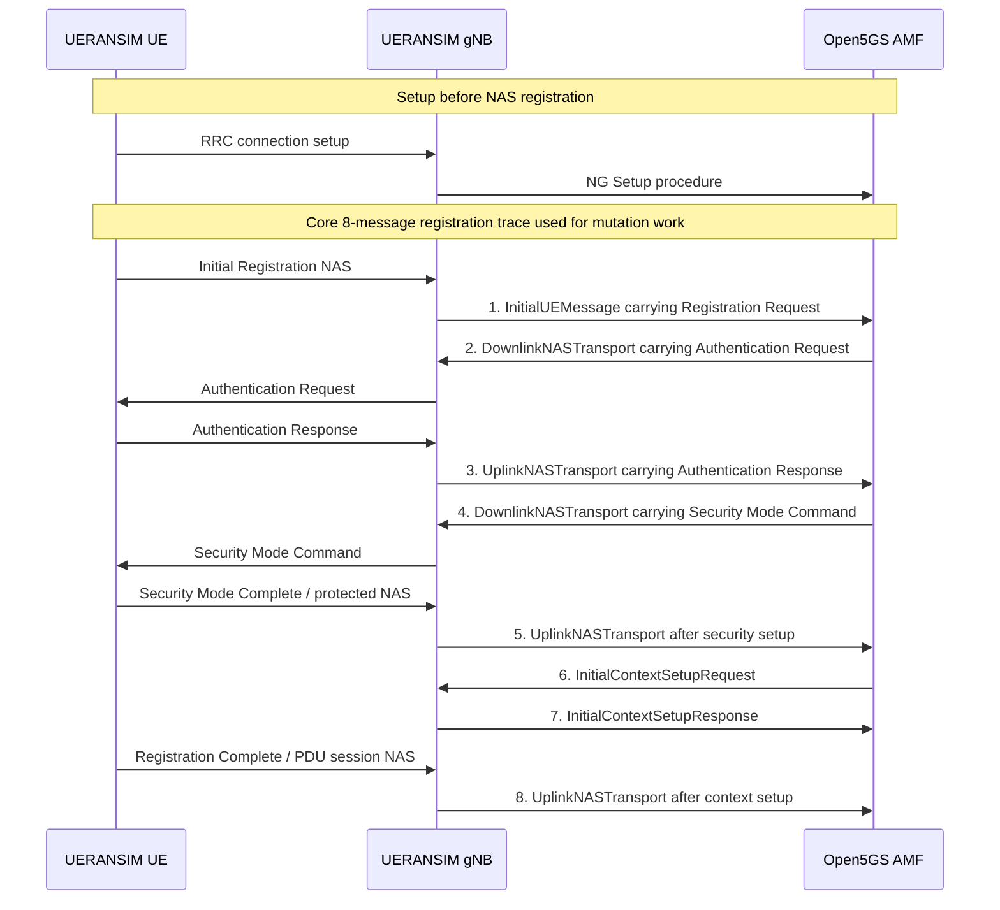
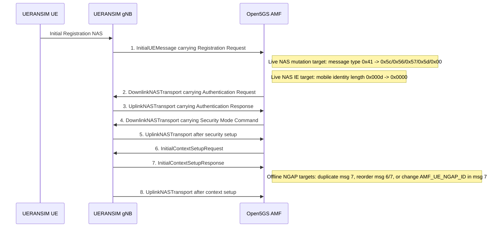
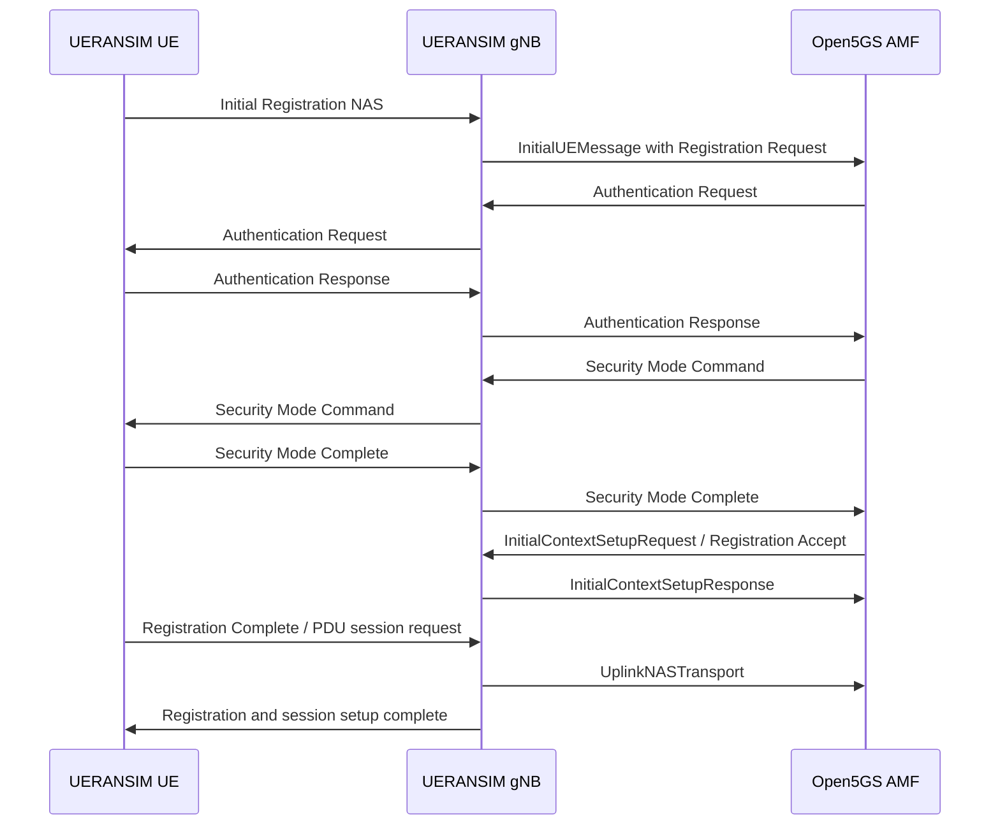

# Formal Results Section Draft

## Experimental Setup

We implemented a software-only 5G control-plane testbed using `Open5GS` as the 5G core and `UERANSIM` as the simulated `UE` and `gNB`. The setup was configured on a single Ubuntu 22.04.5 machine using loopback addresses. The `PLMN` configuration was aligned across components using `MCC=001`, `MNC=01`, and `TAC=1`. A matching subscriber profile was inserted into `Open5GS` so that a clean baseline registration procedure could be established.

Once the baseline configuration was validated, we captured a successful NGAP/NAS registration trace and converted it into a structured intermediate representation. This representation preserved the message order, NGAP identifiers, and, where available, the raw NAS payload bytes. We then used this structured trace to generate controlled mutation cases.

## Baseline Behavior

In the clean baseline run, the simulated UE successfully completed the initial 5G registration procedure. The observed message flow included:

- successful `NG Setup` between `gNB` and `AMF`
- `InitialUEMessage` carrying a valid `Registration request`
- `Authentication request` and `Authentication response`
- `Security mode command`
- successful registration completion
- successful PDU session establishment

This baseline run established the expected normal behavior of the system and served as the reference point for later mutated experiments.

### Baseline Flow Diagram

The normal, genuine registration flow can be summarized as:

The mutation cases were generated from this baseline sequence. In particular:

- `case1` duplicates message 7, `InitialContextSetupResponse`.
- `case2` reorders message 6, `InitialContextSetupRequest`, and message 7, `InitialContextSetupResponse`.
- `case3` changes the `AMF_UE_NGAP_ID` inside message 7.
- `case4` changes the structured NAS meaning of message 1 from `Registration request` to `Identity response`.
- `case5` changes the actual raw NAS message-type byte inside message 1 from `0x41` to `0x5c`.

The same baseline can also be shown as a mutation target map:

For a more UE-facing view, the same flow can be understood as:

In simple terms, the UE first connects to the gNB, the gNB connects to the AMF, and then the UE registration messages are exchanged through the gNB. In the baseline case, these messages are valid, so authentication, security setup, registration completion, and PDU session setup all succeed. This baseline is the normal reference flow used to compare the mutated cases.

## Mutation Design

Several mutation cases were generated from the captured registration trace, including message duplication, reordering, identifier mismatches, and NAS-aware message-type mutation. The most important early case was the mutation of the first NAS message from a valid `Registration request` to a different 5GMM message type.

The first raw-payload NAS mutation changed the initial NAS message type byte from:

- `0x41` (`Registration request`)

to:

- `0x5c` (`Identity response`)

This mutation was first validated offline by confirming that the structured trace and the raw NAS payload changed consistently. The mutation was then implemented in the live UE send path so that the running `UERANSIM UE` would emit the mutated first NAS message.

## Live Mutation Experiments

### First live attempt

The initial live experiment successfully triggered the UE-side mutation. However, the malformed NAS message caused the `UERANSIM gNB` path to crash before the message reached the `AMF`. The observed failure was a runtime error related to NAS parsing:

- `BCD string contains invalid characters`

This showed that a malformed first NAS message could break the gNB-side processing path before the core network had a chance to inspect the message.

### Second live attempt

To address the gNB-side crash, the gNB NAS handling code was modified to fail open. In this mode, if the gNB could not safely decode or modify the malformed NAS, it would forward the original NAS bytes unchanged instead of crashing. This change successfully eliminated the parser crash.

However, the next blocker appeared during AMF selection. Because the malformed NAS no longer carried extractable slice information, the gNB could not determine a suitable AMF and failed before forwarding the message to the core.

### Third live attempt

To address this second blocker, the gNB AMF-selection logic was modified to fall back to the first connected AMF whenever slice extraction failed. With this change in place, the malformed first NAS message was finally delivered end-to-end into `Open5GS`.

The resulting `AMF` log showed:

- reception of `InitialUEMessage`
- allocation of temporary `RAN_UE_NGAP_ID` and `AMF_UE_NGAP_ID`
- rejection of the NAS payload with:
  - `Invalid 5GMM message type [92]`

The AMF then removed the temporary UE context, indicating that the malformed input was handled as an invalid control-plane message rather than causing a process crash.

## Main Result

The main result of this experiment is that we successfully delivered a live-mutated malformed first NAS message into the 5G core and observed a concrete core-network reaction. Specifically:

- the UE emitted a malformed first NAS message
- the gNB forwarded it without crashing
- `Open5GS AMF` received the malformed NAS
- `Open5GS` rejected it with:
  - `Invalid 5GMM message type [92]`

This demonstrates that the prototype is capable of performing controlled malformed-control-plane experiments end-to-end on a live 5G stack.

## Interpretation

This result is important for two reasons.

First, it shows that the experimental harness is now functioning as intended. The project is no longer limited to offline trace mutation; it can inject malformed control-plane input into the live system and observe the resulting behavior.

Second, it shows that failures can occur at multiple layers:

- initially at the gNB parsing layer
- then at gNB AMF-selection logic
- and finally at the AMF NAS-validation layer

This reinforces the value of end-to-end testing. A malformed message does not simply “fail” in one generic way. Instead, different components react differently depending on how tolerant or fragile their handling logic is.

## Next Steps

The next logical direction is to repeat the same end-to-end method for multiple alternative first NAS message types. Instead of testing only the `0x5c` mutation, the same procedure can be extended to other message-type values such as:

- `0x56` (`Authentication request`)
- `0x57` (`Authentication response`)
- `0x5d` (`Security mode command`)

This would allow the project to build a small response matrix showing how `Open5GS` reacts to different malformed first-message conditions.
