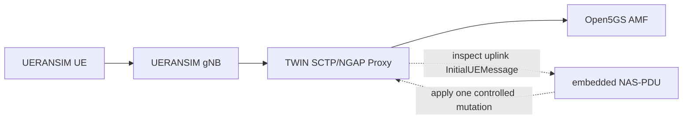
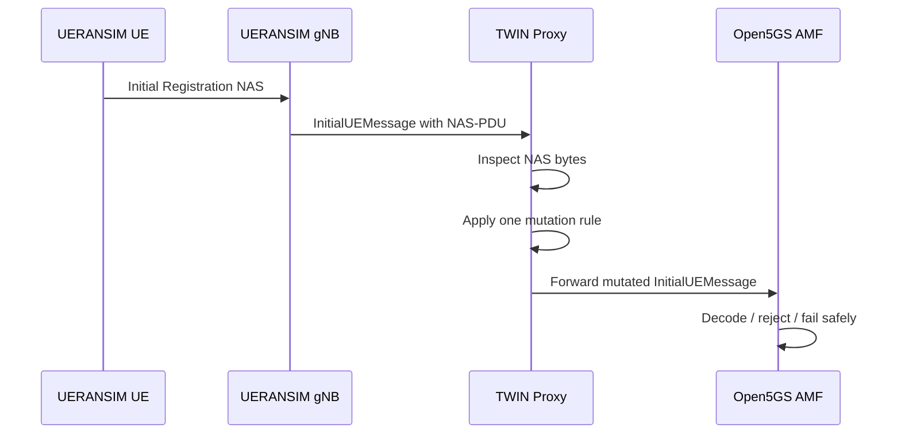

# Proxy-Based Live Mutation Results

## 1. What this section is about

This section explains the proxy-based experiments that were performed after the earlier UE-side mutation work.

In simple words:

- before, we mutated the first NAS message inside the running `UE`
- now, we place a proxy between the `gNB` and the `AMF`
- the proxy watches the live `InitialUEMessage`
- the proxy changes one selected NAS field
- the proxy forwards the modified message to `Open5GS`

This is important because it proves that malformed control-plane messages can now be injected without modifying the UE for every single experiment.

## 2. Proxy architecture

The original path was:

```text
UERANSIM gNB -> Open5GS AMF
```

The proxy path used in these experiments was:



In noob language:

- `NGAP` is the outer transport message between `gNB` and `AMF`
- `NAS-PDU` is the NAS message carried inside it
- the proxy acts like a middleman
- it looks inside the first uplink registration message
- it changes one chosen field
- then it forwards the result to the real core network

## 3. Proxy experiment flow

The general experimental flow was:



This process was repeated for multiple mutation values.

## 4. Transparent proxy validation

Before any mutation was enabled, the proxy was tested in transparent relay mode.

Observed behavior:

- `gNB` established SCTP with the proxy
- the proxy established SCTP with the real `AMF`
- `NG Setup` succeeded
- clean UE registration succeeded through the proxy
- PDU session setup also succeeded

This validation step was important because it showed that the proxy itself did not break the baseline 5G behavior.

## 5. Message-type mutation campaign

### 5.1 What was mutated

In a normal registration, the first NAS message is:

```text
Registration Request = 0x41
```

The proxy looked for the plain NAS signature:

```text
7e 00 41
```

and replaced the third byte `0x41` with a selected target value.

This means the proxy changed the message type while keeping the surrounding live NGAP traffic real.

### 5.2 Why this matters

This tests the question:

```text
What happens if the very first NAS message reaching the AMF is the wrong kind of 5GMM message?
```

### 5.3 Proxy message-type results

| Proxy mutation | Meaning | AMF result | Result class |
| --- | --- | --- | --- |
| `0x41 -> 0x5c` | `Registration Request -> Identity Response` | `Invalid 5GMM message type [92]` | early semantic reject |
| `0x41 -> 0x56` | `Registration Request -> Authentication Request` | `Invalid 5GMM message type [86]` | early semantic reject |
| `0x41 -> 0x57` | `Registration Request -> Authentication Response` | `Invalid 5GMM message type [87]` | early semantic reject |
| `0x41 -> 0x5d` | `Registration Request -> Security Mode Command` | `Invalid 5GMM message type [93]` | early semantic reject |
| `0x41 -> 0x00` | `Registration Request -> invalid or unknown value` | `Invalid 5GMM message type [0]` | early semantic reject |

### 5.4 Interpretation

All five proxy-side message-type mutations produced the same high-level pattern:

1. the proxy successfully modified the first NAS message
2. the AMF received the mutated `InitialUEMessage`
3. `Open5GS` rejected the malformed first NAS message
4. the AMF process remained alive

In simple words, this means the proxy successfully injected wrong first NAS message types into the live 5G core, and the core rejected them safely instead of crashing.

## 6. Mandatory-field corruption campaign

### 6.1 What was mutated

The next experiment kept the first NAS message as a real:

```text
Registration Request
```

but corrupted a mandatory field inside it.

The relevant bytes at the beginning of the NAS payload were:

```text
7e 00 41 79 00 0d ...
```

The proxy changed:

```text
00 0d -> 00 00
```

So the beginning became:

```text
7e 00 41 79 00 00 ...
```

This means the mobile-identity length field was corrupted from `0x000d` to `0x0000`.

### 6.2 Why this is stronger

This mutation is stronger than a simple wrong-message-type mutation.

Why?

- the AMF still sees the message as a `Registration Request`
- so it begins normal `Registration Request` decoding
- the failure only appears when the decoder reaches the corrupted mandatory field

In simple words:

```text
the message looks correct at first glance, but breaks when the core tries to read an important inside field
```

### 6.3 Observed AMF failure

The `AMF` log showed:

- `InitialUEMessage`
- multiple NAS decode errors
- `ogs_nas_5gs_decode_5gmm_capability() failed`
- `ogs_nas_5gs_decode_registration_request() failed`
- `ogs_nas_5gmm_decode() failed`

This is best classified as:

```text
deep NAS decoder failure
```

instead of:

```text
early semantic reject
```

## 7. Result-class summary

The proxy results can be grouped into behavior classes:

| Result class | Meaning | Proxy cases observed |
| --- | --- | --- |
| `early semantic reject` | the AMF quickly recognized that the first NAS message type was invalid for that stage | `0x5c`, `0x56`, `0x57`, `0x5d`, `0x00` |
| `deep NAS decoder failure` | the AMF started decoding the message as a valid `Registration Request` and failed deeper inside NAS parsing | `mobile identity length 0x000d -> 0x0000` |
| `AMF crash` | AMF process terminates unexpectedly | not observed |
| `proxy crash` | proxy process terminates unexpectedly because of the malformed message | not observed |
| `unexpected accept` | malformed first NAS is accepted as normal | not observed |

## 8. Metrics view

A useful project-level summary of the proxy campaign is:

| Metric | Value |
| --- | --- |
| transparent proxy validation runs | `1` successful |
| proxy-delivered first NAS message-type mutations | `5` |
| proxy-delivered mandatory-field corruption mutations | `1` |
| early semantic rejects observed | `5` |
| deep NAS decoder failures observed | `1` |
| AMF crashes observed during proxy campaign | `0` |
| proxy crashes observed during proxy campaign | `0` |

These numbers are useful because they show not only how many mutations were attempted, but also what kind of behavior they triggered.

## 9. Ideal behavior vs observed behavior

The ideal behavior of a 5G core against such malformed input is:

- reject the malformed message safely
- not crash
- not hang
- not accept invalid input
- clean up temporary state if needed
- continue operating normally for later clean registrations

Observed behavior in our proxy experiments was close to this ideal:

- malformed first NAS messages were rejected
- decoder errors were logged clearly
- the AMF process stayed alive
- later clean UE retries succeeded

This means the proxy campaign did not reveal an AMF crash, but it did demonstrate both shallow and deep error-handling paths in the NAS processing logic.

## 10. Why these proxy results matter

These results are important for the project because they show that the proxy is now a real live mutation point, not just a plan.

In practical terms, we have demonstrated that:

1. the proxy can sit transparently between the `gNB` and the `AMF`
2. the proxy can mutate the embedded first NAS message in live traffic
3. the same mutation logic can be reused across multiple experiments
4. different mutation families lead to different classes of core-network reaction

This creates a strong foundation for the next project phase, where the proxy can be extended to:

- run larger NAS mutation campaigns
- support additional field-level NAS corruptions
- eventually move to later-message and stateful NGAP mutations

## 11. Final conclusion

In simple words, the proxy results show that we can now intercept the first registration message on the live `gNB -> AMF` path, modify it in a controlled way, and observe how the real 5G core reacts.

The message-type mutations showed consistent safe rejection by `Open5GS`.
The mobile-identity-length corruption showed a deeper decoder-failure path inside NAS parsing.

Together, these results make the proxy-based mutation framework a working experimental platform for further 5G control-plane robustness testing.
